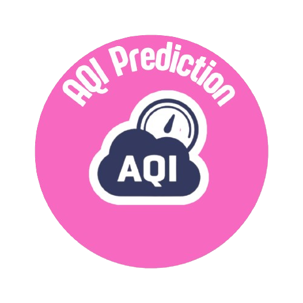

  
  

<h1 align="center">🧚🏽‍♀️✨ Mariam Rehan ✨🧚🏽‍♀️</h1>

Desi ✦ Dreamer ✦ Data Scientist in the Making ✦ Future Germany Girlie 🇵🇰 → 🇩🇪

---

### 💖 Who is she?

Hi!! I'm Mariam! I'm a girl with a big love for creating things, with even bigger dreams, and a borderline romantic obsession with data, beauty, and anything magical.  
I’m on a mission to become one of Pakistan’s most versatile data scientists, while staying true to myself and enjoying every bit of the journey there. If there's anything I'm sure of, it's that I'm NOT gonna lose my spark as a corporate girl  🙏

---

### 💖 Featured Projects

  
  &nbsp;&nbsp;&nbsp;
  
  &nbsp;&nbsp;&nbsp;
  
  </a>
  &nbsp;&nbsp;&nbsp;
  
  

---

### 💖 What fuels me?  
- 🎀 Anime, Barbie movies, and code that *actually* runs  
- 🌟 Helping people feel seen and understood through data  
- ☁️ Being *that girl* who turns crazy messy CSVs into magical insightful dashboards  
- 🍵 Manifesting a happy girl tech life in Germany with a view, vibes, and a visa 😭

---

### 💖 What I do (besides yapping):

- 🧠 Data analysis & visualization (This is what I'm best at trust me)
- 🛰️ Real-time prediction pipelines (because we're predicting ANYTHING these days)
- 📊 Storytelling with dashboards (Power BI, Tableau, Streamlit, you name it!)
- 🤖 AI & ML baby steps (I'm trying T^T)

---

### 💖 My tech toolkit:

---

### 💌 Links to connect and yap with me:

  

---

<i>"If it’s not in a pretty dashboard, it was NOT made by me"</i>

  

